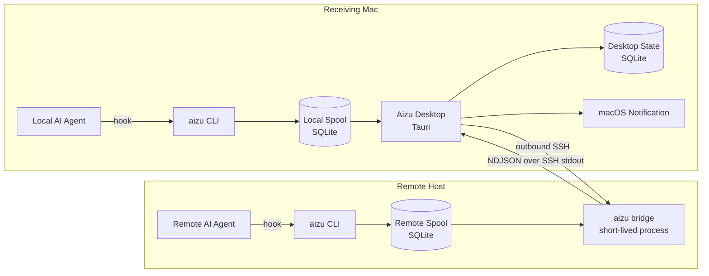

# Aizu MVP Design Doc

- **Status:** Draft
- **Last updated:** 2026-08-12
- **Target:** macOS-first MVP
- **Working name:** Aizu
- **Primary implementation language:** Rust

## 1. Summary

Aizu は、端末上で動作する AI/LLM エージェントの以下のイベントを、デスクトップのネイティブ通知として表示するアプリである。

1. エージェントの実行が完了した
2. エージェントがユーザー入力・許可・回答を待っている
3. 同じ端末だけでなく、SSH 接続可能なリモート端末で発生したイベント

MVP では **中央バックエンド、クラウド API、常駐リレーサーバーを設けない**。リモート通知には既存の SSH 接続を利用する。

- 受信側 Mac からリモート端末へ SSH 接続する。
- リモート端末には、エージェントのフックから呼び出す単一 CLI を置く。
- リモート CLI はイベントをローカル SQLite に保存する。
- デスクトップアプリは SSH 経由でリモート CLI の `bridge` コマンドを起動し、標準出力からイベントを受信する。
- リモート側にデーモン、待受ポート、Web サーバーは置かない。
- SSH が切れている間のイベントはリモート端末に保存し、再接続後に配送する。

GitHub Releases はアプリの配布・更新ファイルの静的ホスティングにだけ利用し、通知イベントの経路には利用しない。

## 2. Background

ターミナル型 AI エージェントは長時間動作することがあり、利用者が別アプリや別端末で作業している間に以下を見逃しやすい。

- タスク完了
- 追加質問
- 権限確認
- 入力待ち

単一端末だけなら OS 通知で解決できるが、実際の開発では SSH 先、開発サーバー、ワークステーションなどでもエージェントを動かす。そのため、ローカル通知とリモート通知を同じイベントモデルで扱う必要がある。

一方、MVP のためだけに中央バックエンドを運用すると、認証、暗号化、データ保持、監視、料金、障害対応が必要になる。本設計では、すでに利用者が管理している SSH の認証・暗号化・ホスト検証を再利用する。

## 3. Goals

### 3.1 Product goals

- macOS 上でメニューバー常駐アプリとして動作する。
- Finder、Dock、通知、設定画面で識別できる正式な app icon と、light/dark menu bar に適応する専用 tray icon を持つ。
- ローカル端末の `task.completed` と `agent.question` を通知できる。
- SSH で到達可能なリモート端末の同イベントを通知できる。
- デスクトップアプリや SSH が一時停止してもイベントを失いにくい。
- 複数リモート端末を登録し、接続状態を確認できる。
- エージェント固有形式を共通イベント形式へ変換できる。
- 通知権限、SSH、CLI、イベント保存領域の問題を `doctor` で診断できる。

### 3.2 Engineering goals

- Rust-first とし、event model、CLI、SQLite、SSH、protocol、notification policy、Tauri backend を Rust workspace で共有する。
- TypeScript/React は desktop の presentation layer に限定し、信頼境界・状態遷移・business logic を持たせない。
- 通知配送に中央バックエンドを必要としない。
- リモート側に常駐サービスや待受ポートを必要としない。
- イベントモデル、保存、SSH bridge、通知ポリシーを Rust の共有コアに置く。
- 将来の Windows/Linux デスクトップ対応を妨げない。
- 将来の Slack/Discord/モバイル向け送信先を `Sink` として追加できる。
- ユニット、統合、E2E、パッケージ検証を CI に組み込む。
- macOS リリースを署名・notarization したうえで GitHub Releases に公開できる。

## 4. Non-goals

以下は MVP の対象外とする。

- 独自の中央通知サーバー、ユーザーアカウント、端末同期 API
- Mac が停止中でも即時にモバイルへ通知する機能
- iPhone / Apple Watch アプリ、APNs 配信
- Slack / Discord / Teams 連携
- Windows/Linux 向けデスクトップアプリの正式配布
- 通知からエージェントへ回答を返す双方向操作
- ターミナル画面や標準出力を常時スクレイピングして状態を推測する機能
- エージェントの会話全文や生成結果の同期・保存
- パスワードや SSH 秘密鍵の独自管理

## 5. Important constraints

### 5.1 バックエンドなしで可能な範囲

受信側 Mac がリモート端末へ SSH 接続できることを MVP の前提とする。

この前提を満たさない場合、中央リレーなしではリアルタイム配送できない。例えば、次のケースは MVP では即時通知できない。

- リモート端末へ Mac から到達できない
- Mac が電源オフまたはオフライン
- リモートイベントを Mac を経由せず iPhone/Apple Watch へ送りたい

SSH 切断中に発生したイベントはリモート側へ保存されるため、Mac とリモート端末が再接続できれば後から受信できる。

### 5.2 リモート側に置くもの

リモート側に置くのは `aizu` CLI のみである。

- エージェントフックから `aizu emit` または `aizu hook` を実行する。
- CLI はユーザー領域の SQLite ファイルへイベントを書き込む。
- デスクトップから SSH 接続された間だけ `aizu bridge` が動く。
- systemd、launchd、Windows Service などへの登録はしない。
- TCP/UDP ポートを開かない。

ここでいう `bridge` は SSH の子プロセスであり、独立したサーバーアプリではない。

### 5.3 エージェント連携

エージェントの完了・質問を確実に判定するには、そのエージェントが提供する hook/notification 機構を利用する。画面出力の文字列解析は行わない。MVP の first-party 対応対象は **Codex と Claude Code の両方**とする。

MVP コアはエージェント非依存の CLI 契約を提供する。Codex は `Stop` と `PermissionRequest`、Claude Code は `Stop`、`StopFailure`、`PermissionRequest` の lifecycle hook を first-party adapter で共通 event へ変換する。任意の hook から共通 JSON を渡す generic integration も維持する。

通知保証は agent が hook を実行した event に限る。agent が crash/SIGKILL/host power loss 時に hook を発火しない場合、Aizu は terminal scraping や process supervisor を持たないため、その終了を検出できない。正式対応 agent の選定時は成功・失敗・キャンセル・質問/許可待ちの各 hook coverage を確認し、未対応状態を setup UI に明示する。

## 6. User stories

### 6.1 ローカル通知

1. ユーザーが Aizu を起動する。
2. 「通知をテスト」を押し、macOS の通知権限を許可する。
3. 「CLI をインストール」を押し、`~/.local/bin/aizu` を配置する。
4. 使用するエージェントの hook に `aizu hook ...` を設定する。
5. エージェントが完了または質問状態になる。
6. CLI がローカル spool にイベントを追加する。
7. Aizu がイベントを読み取り、macOS 通知を表示する。

### 6.2 リモート通知

1. ユーザーがリモート端末へ `aizu` CLI をインストールする。
2. リモート側エージェントの hook を設定する。
3. Aizu の「Remote Sources」で既存の SSH config のホスト alias を登録する。
4. Aizu が system SSH client で疎通確認する。
5. 接続後、Aizu が `aizu bridge --follow` を SSH 経由で起動する。
6. リモートイベントが NDJSON として Mac に流れる。
7. Aizu が重複排除・通知ポリシー適用後、macOS 通知を表示する。

### 6.3 切断後の再配送

1. Mac がスリープまたは SSH が切断される。
2. リモートエージェントが完了し、イベントがリモート spool に残る。
3. Mac の復帰後、Aizu が指数バックオフ付きで再接続する。
4. 最後に保存した cursor より後のイベントを取得する。
5. 大量の未読イベントは個別通知を制限し、サマリー通知へまとめる。

## 7. Proposed architecture



### 7.1 Components

#### `aizu-core`

Rust library containing:

- normalized event model
- validation and redaction
- SQLite migrations and repositories
- bridge protocol types
- source cursor and deduplication rules
- notification policy
- adapter and sink traits
- retry/backoff primitives

#### `aizu-cli`

Single Rust binary used on local and remote hosts.

Primary commands:

```text
aizu emit <task.completed|agent.question> [options]
aizu emit --stdin-json
aizu hook --agent <agent-id> --event <agent-event>
aizu integration-config --agent <codex|claude-code> --aizu-path <absolute-path>
aizu integration-install [--agent <codex|claude-code>] [--aizu-path <absolute-path>] [--json]
aizu bridge --protocol 1 --after <sequence> --follow
aizu doctor [--json]
aizu identity regenerate [--discard-events]
aizu version --json
```

Responsibilities:

- hook inputを normalized eventへ変換する
- eventを spoolへ短時間で保存する
- bridge protocolを標準出力へ出す
- spoolのmigration・pruningを行う
- 診断情報を機密情報なしで出力する
- Codex / Claude Code の既存設定を上書きせず、明示的 merge 用 hook JSON を生成する
- current user の既存 JSON と Aizu hook を構造化 merge し、同一 directory の private temporary file から atomic install する

`aizu identity regenerate` は cloned image/home directory により 2 host が同じ `source_id` を持った場合の recovery 用である。source を desktop で disable した状態の exclusive maintenance lock を要求し、lock を取得できなければ拒否する。既定では spool に event が残っていると拒否する。`--discard-events` は明示確認を要求し、既存 DB を backup してから retained event を破棄し、新しい `source_id` と sequence `0` で開始する。自動実行しない。

#### `aizu-desktop`

Tauri 2 ベースのデスクトップアプリ。

Responsibilities:

- メニューバー常駐
- ローカル spool の監視
- SSH source のプロセス管理
- イベント ingest、cursor 保存、重複排除
- 通知ポリシーとネイティブ通知
- source 設定、履歴、診断 UI
- ログイン時起動
- CLI sidecar のユーザー領域へのインストール
- アプリ更新確認
- app icon、tray template icon、UI symbol の platform 別 asset 適用

#### `SystemSshSource`

デスクトップから OS の SSH client を起動する source adapter。

- macOS MVP では `/usr/bin/ssh` を利用する。
- ユーザーの `~/.ssh/config`、ssh-agent、known_hosts、ProxyJump 等をそのまま利用する。
- Aizu は秘密鍵・パスワードを保存しない。
- background 接続は `BatchMode=yes`、`StrictHostKeyChecking=yes`、bounded timeout で実行し、prompt を待たない。
- GUI 内でパスワード入力を代行しない。
- 非対話接続できない場合は、ユーザーに通常の Terminal で一度接続・認証準備するよう案内する。
- login item/GUI app は interactive shell の PATH や一時的な `SSH_AUTH_SOCK` を継承するとは限らない。shell rc を source せず、`/usr/bin/ssh` と SSH config の `IdentityFile` / `IdentityAgent` 等で再現可能な認証を案内する。
- first successful `hello` の `source_id` を pin し、SSH alias が別 spool を指すようになった場合は自動で cursor を流用しない。

## 8. Data model

### 8.1 Normalized event

```json
{
  "schema_version": 1,
  "id": "0198a012-3456-7abc-8def-0123456789ab",
  "kind": "agent.question",
  "occurred_at": "2026-08-12T12:34:56.789Z",
  "source": {
    "source_id": "7a4881c7-c667-47dc-b544-f98a46ab17ca",
    "display_name": "build-server",
    "agent": "generic",
    "session_id": "optional-session-id"
  },
  "title": "Agent is waiting for input",
  "body": "Approval is required to continue.",
  "urgency": "high",
  "metadata": {
    "working_directory_name": "project-name"
  }
}
```

### 8.2 Required rules

- `schema_version`: integer。MVP は `1`。
- `id`: UUIDv7。source 内で一意でなければならない。
- `kind`: MVP では `task.completed` または `agent.question`。`task.completed` は成功だけでなく、失敗・キャンセルを含む terminal event を意味する。
- `outcome`: `task.completed` では必須で、`succeeded`、`failed`、`cancelled`、`unknown` のいずれか。hook が outcome を提供しない場合は `unknown`。
- `occurred_at`: UTC RFC 3339。offset 表記ではなく `Z` suffix を必須にする。
- `source.source_id`: 初回実行時に UUID として生成し、host name とは別に永続化する。
- `source.display_name`: 1〜200 Unicode scalar values。source が報告する候補名であり、desktop notification の authoritative label には使わない。
- `source.agent`: 1〜100 Unicode scalar values。
- `source.session_id`: optional、最大 200 Unicode scalar values。
- `title`: 最大 120 Unicode scalar values。
- `body`: 最大 1,000 Unicode scalar values。
- event 全体: 最大 64 KiB。
- metadata: JSON object。秘密、会話全文、生の環境変数を入れない。
- `urgency`: source からの hint に過ぎず、desktop の user policy、quiet hours、event kind が最終決定する。remote payload だけで sound/bypass を強制できない。
- title/source identifiers では control characters を拒否する。body では改行・tab 以外の C0 control characters と DEL を拒否する。
- 将来の optional field は top-level、`source`、`metadata` のいずれでも許容し、receiver は未知 field を無視する。
- 過大 payload、未知の必須型、MVP が扱えない `schema_version` / `kind` は拒否する。

`event-v1` の `task.completed` には必ず `outcome` を入れる。CLI の入力で省略された場合は、正規化時に `unknown` を補う。
`occurred_at` は source clock に基づく表示情報であり、ordering、cursor、deduplication、retention の信頼基準にしない。desktop は別途 `received_at` を記録し、sequence 順に処理する。source と desktop の clock skew が 5 分を超える場合は diagnostics/history に warning を付けるが、event 自体は失わない。
notification に表示する source label は pinned `source_id` に紐づく desktop 側設定を使う。remote event の `source.display_name` は初回候補/診断情報としてのみ扱い、別 source を装う表示名をそのまま lock-screen notification に使わない。

### 8.3 Privacy defaults

通知本文はロック画面などに表示される可能性があるため、初期値は保守的にする。

- `task.completed`: outcome に応じて “Task finished/failed/cancelled on &lt;source&gt;”。`unknown` は “Task finished”。
- `agent.question`: “Agent is waiting for input on &lt;source&gt;”
- プロンプト全文や生成物を本文へ自動挿入しない。
- adapter が要約を付けられる場合も、設定で opt-in とする。
- path は原則 basename のみ。絶対パスは保存しない。
- 通常ログへ title/body を出さない。

## 9. Event storage

### 9.1 Spool database

ローカル・リモート CLI が以下の SQLite を持つ。

```sql
CREATE TABLE events (
    sequence       INTEGER PRIMARY KEY CHECK (sequence > 0),
    event_id       TEXT NOT NULL UNIQUE,
    schema_version INTEGER NOT NULL,
    kind           TEXT NOT NULL,
    occurred_at    TEXT NOT NULL,
    payload_json   TEXT NOT NULL,
    inserted_at    TEXT NOT NULL
);

CREATE TABLE source_identity (
    singleton      INTEGER PRIMARY KEY CHECK (singleton = 1),
    source_id      TEXT NOT NULL,
    created_at     TEXT NOT NULL,
    high_watermark INTEGER NOT NULL DEFAULT 0 CHECK (high_watermark >= 0),
    last_maintenance_at TEXT
);

CREATE TABLE schema_migrations (
    version        INTEGER PRIMARY KEY,
    applied_at     TEXT NOT NULL
);
```

macOS の想定パス:

```text
~/Library/Application Support/Aizu/spool.sqlite3
~/Library/Application Support/Aizu/desktop.sqlite3
```

実装では OS path API を使い、文字列連結でパスを組み立てない。

`emit` は単一 transaction 内で `source_identity.high_watermark` を 1 増加させ、その値を新規 event の `sequence` として使う。これにより全 event が prune された後も、過去に割り当てた最大 sequence を保持でき、gap と source rewind を正しく検出できる。

### 9.2 SQLite behavior

- OS 付属 SQLite ではなく、WAL-reset 修正を含む SQLite を bundled dependency として使う。最低基準は SQLite `3.51.3` 以降、または公式の修正版 backport (`3.50.7` / `3.44.6`) とし、CI と `doctor` で runtime version を検証する。
- `PRAGMA journal_mode=WAL`、`PRAGMA synchronous=FULL`、bounded busy timeout を設定し、実際に WAL が有効になったことを確認する。
- 新規 DB は schema 作成前に `auto_vacuum=INCREMENTAL` を設定し、bounded incremental vacuum を可能にする。
- `emit` は短い transaction だけを行う。
- 複数 hook の同時実行をテストする。
- DB directory は `0700`、DB/WAL/SHM file は原則 `0600` とする。
- spool は同一 host 上の local filesystem に限定する。macOS は mount の local flag、Linux は明示的に対応する local filesystem type で fail-closed に判定する。network/FUSE/unknown filesystem など WAL を安全に共有できない配置は `doctor` error とし、別 journal mode へ黙って fallback しない。
- migration 前に互換性を確認し、失敗時はイベントを書き換えない。
- app/CLI は同じ `aizu-core` migration を使い、migration を exclusive transaction で serialize する。別 process が migration 中なら bounded retry し、hook を無期限 block しない。
- binary が自分より新しい DB schema を検出した場合は read/write せず `incompatible_database` として終了する。app update は bundled CLI の install/version 確認後に local DB migration を行い、少なくとも直前 release の reader/writer compatibility を migration test する。
- corruption 時は元 DB を保持し、自動削除しない。

### 9.3 Retention

MVP 既定値:

- local spool への durable insert 時刻 `inserted_at` から 30 日経過したイベントを削除（untrusted `occurred_at` は retention に使わない）
- または 100,000 件を超えた古いイベントを削除
- または保存済み payload の論理合計が 256 MiB を超えた場合、古いイベントから削除
- maintenance は app/bridge 起動時、および `last_maintenance_at` から 24 時間以上経過した `emit` 時に決定論的に実行
- hook path の maintenance は bounded batch に限定し、残りは desktop/bridge の idle 時に継続
- prune 後は WAL checkpoint と bounded incremental vacuum を idle 時に実行し、disk 使用量の上限を回復させる

desktop cursor より前にリモートイベントが削除されていた場合、bridge は `gap` frame を送り、Aizu は欠落警告を履歴へ記録する。
desktop は gap warning と cursor の `lost_through_sequence` への更新を同一 transaction で行い、再接続のたびに同じ gap を再処理しない。その後、retained event があれば通常の event transaction で続きを処理する。
bridge 読み取りと maintenance が競合した場合も、sequence の jump を暗黙に飛ばさず mid-stream `gap` を送る。bridge は短い read transaction と bounded page で backlog を読み、全件を memory に保持しない。

### 9.4 ローカル spool の監視

SQLite はプロセス間の変更通知機構を持たないため、デスクトップは次の方法でローカル spool の新規イベントを検出する。

- 最後に読み取った `sequence` を保持し、短い間隔（例: 1 秒以下）で新しい `sequence` をポーリングする。
- WAL mode 下でも別プロセスの commit を確実に読めるよう、読み取りごとに最新 snapshot で query する。
- スリープ復帰、アプリ前面化、手動更新時は間隔を待たずに即時再ポーリングする。
- ポーリング間隔は §22.1 の完了通知 2 秒以内目標を満たす値にする。
- ポーリング処理は UI thread を block せず、bounded query time で実行する。
- local reader も `source_identity.high_watermark` と retained minimum を比較し、app 停止中に prune された event を remote と同じ gap warning/cursor transaction で処理する。

将来 OS 別の file-watch（macOS `FSEvents` など）を latency 最適化として追加してよいが、正しさは常にポーリングで担保し、file-watch は取りこぼし得る通知として扱う。リモート source は §10 の bridge protocol で push されるため、このポーリングはローカル spool にのみ適用する。

### 9.5 Desktop history retention

- desktop history は既定 30 日、10,000 events、payload 論理合計 128 MiB のいずれかを超えた古い delivered event から削除する。
- `pending` outbox は履歴 retention の対象外とし、delivered/suppressed/failed-terminal のいずれかへ遷移してから削除できる。
- “Clear history” は表示 payload と completed outbox を削除するが、source cursor、pinned `source_id`、最小限の dedup state は保持する。履歴消去を再通知や cursor reset の契機にしない。
- event payload 削除後の exact replay 検出に使う desktop tombstone も既定 30 日または 10,000 件で bounded prune する。source ごとの高水位 checkpoint は tombstone とは別に保持し、tombstone 削除後も source の再登録・再接続で cursor を巻き戻さない。
- clear/prune 後は WAL checkpoint と bounded incremental vacuum を idle 時に行う。SQLite の page/WAL に残った過去 data の即時 secure erase は保証せず、その制約を privacy UI に明記する。

## 10. Bridge protocol

SSH の標準出力に UTF-8 NDJSON を流す。ネットワークポートや独自 TLS は使用しない。

### 10.1 Command

概念上のコマンド:

```text
/usr/bin/ssh -T -n \
  -o BatchMode=yes \
  -o StrictHostKeyChecking=yes \
  -o ConnectTimeout=10 \
  -o ConnectionAttempts=1 \
  -o ServerAliveInterval=15 \
  -o ServerAliveCountMax=3 \
  -o ClearAllForwardings=yes \
  -o ForwardAgent=no \
  -o ForwardX11=no \
  -o PermitLocalCommand=no \
  <validated-host-alias> \
  'exec "$HOME/.local/bin/aizu" bridge --protocol 1 --after 123 --follow'
```

OpenSSH は host 以降の command arguments を space 区切りで再構成して remote shell へ渡す。そのため、ローカル process arguments を分離するだけでは remote shell injection 対策にならない。

MVP は remote CLI path を `$HOME/.local/bin/aizu` に固定し、上記の固定 template へ、数値として検証済みの protocol version と cursor だけを埋め込む。任意の remote command/path を UI から指定させない。host alias はローカル `ssh` の独立 argument とし、先頭 `-`、NUL、改行を拒否する。将来 Windows remote や custom path を追加する場合は OS 別 command encoder と security review を必須にする。

`BatchMode=yes` と `StrictHostKeyChecking=yes` により background 接続で password/passphrase/unknown-host prompt を出さず失敗させる。TTY、stdin、port/X11/agent forwarding、`LocalCommand` は不要なので command-line option で無効化する。`ssh -G <alias>` の preflight で user config の `RemoteCommand` 競合を検出し、専用 alias の作成を案内する。

### 10.2 Frames

```json
{"type":"hello","protocol_version":1,"source_id":"7a4881c7-c667-47dc-b544-f98a46ab17ca","oldest_sequence":1,"latest_sequence":140}
{"type":"event","sequence":124,"event":{"schema_version":1,"id":"0198a012-3456-7abc-8def-0123456789ab","kind":"agent.question","occurred_at":"2026-08-12T12:34:56.789Z","source":{"source_id":"7a4881c7-c667-47dc-b544-f98a46ab17ca","display_name":"build-server","agent":"generic"},"title":"Agent is waiting for input","body":"Approval is required to continue.","urgency":"high"}}
{"type":"heartbeat","sent_at":"2026-08-12T12:35:30Z"}
{"type":"gap","requested_after":20,"oldest_sequence":80,"lost_through_sequence":79}
{"type":"error","code":"incompatible_protocol","message":"..."}
```

Rules:

- stdout は protocol 専用。人間向けログは stderr。
- event payload は最大 64 KiB、wrapper を含む 1 frame は最大 128 KiB。
- 正常 stream の最初の frame は `hello`。protocol negotiation や spool open に失敗した場合のみ、terminal `error` が最初かつ唯一の frame になり得る。
- desktop は `protocol_version` と `source_id` を検証する。
- desktop は初回成功時に SSH source 設定へ `source_id` を pin する。以後 mismatch した場合は event/cursor を処理せず停止し、ユーザー確認後にのみ別 source として cursor を reset する。
- 同じ `source_id` を返す SSH source を二重登録しない。
- `hello.oldest_sequence` は retained event が無ければ `null`、`latest_sequence` は event が全て prune 済みでも過去に割り当てた high watermark（新規 spool は `0`）。
- `sequence` は source ごとに厳密に増加し、SQLite signed integer に収まる `1..=9223372036854775807`。requested cursor は `0..=9223372036854775807` とし、high watermark より大きい場合は source rewind として停止する。
- SSH child 起動から 20 秒以内に `hello` または terminal `error` が来なければ startup timeout とする。
- event/heartbeat が 15 秒無い場合に heartbeat を送る。desktop は 45 秒 frame が無ければ接続を stale として再接続する。
- bridge は各 NDJSON frame の LF 書き込み直後に stdout を flush し、stdio buffering による通知遅延を避ける。
- `hello` 後の unknown optional frame は無視できる。`hello` 前は `hello` または terminal `error` 以外を protocol violation とする。
- unknown major protocol は接続を停止し、CLI update を案内する。

### 10.3 Delivery semantics

配送は **at-least-once + deduplication** とする。
この保証は source retention window 内に限る。retention/quota により未取得 event が prune された場合は再送不能であり、`gap` warning によって欠落を明示する。

Desktop DB では以下を同一 transaction で行う。

1. `(source_id, sequence)` と `(source_id, event_id)` を unique key として event を insert
2. source cursor を更新
3. notification outbox を `pending` で追加

別 worker が outbox を OS 通知へ送り、成功後 `delivered` にする。state は `pending`、`delivered`、`suppressed`、`failed_retryable`、`failed_terminal` を持つ。

- permission denied、user pause、通知種別 disabled、期限切れ policy は event history を残したまま理由付き `suppressed` とし、無限 retry しない。
- OS scheduling の一時失敗は bounded backoff で `failed_retryable`、permission/API の恒久失敗は `failed_terminal`。
- permission が後から許可されても全 suppressed event を個別再送せず、設定に応じて直近 event または summary を提示する。

クラッシュ位置によって OS 通知が再送される可能性があるため、可能な範囲で event ID 由来の安定した notification identifier を使い、重複表示を抑制する。

### 10.4 Reconnection

- 起動直後は即時接続
- 失敗後は 1, 2, 5, 10, 30, 60 秒の上限付き指数バックオフ
- jitter を追加し、複数 source の同時再接続を避ける
- sleep/wake と network change では backoff を解除して再試行
- user が “Reconnect now” を押した場合も即時再試行
- stderr の同一エラーを無制限に履歴へ追加しない
- retry は source が disable/削除された時、app 終了時、non-retriable security/protocol error 時に cancel する

Retry classification:

- **automatic retry:** network unreachable/refused/reset、startup/stale timeout、unexpected EOF、retryable remote internal error
- **pause until user/config change:** authentication failure、unknown/changed host key、remote CLI missing、`RemoteCommand` conflict、incompatible protocol/database、cursor ahead、source identity mismatch
- network-change/sleep-wake event は network class だけを即時再試行し、security/user-action class を自動解除しない

## 11. Agent adapter contract

### 11.1 Stable generic interface

最小の連携 API は CLI とする。

```bash
aizu emit task.completed \
  --title "Task completed" \
  --outcome succeeded \
  --body "The agent finished."

printf '%s' "$EVENT_JSON" | aizu emit --stdin-json
```

共通 JSON:

```json
{
  "kind": "agent.question",
  "title": "Agent is waiting",
  "body": "Approval is required.",
  "agent": "example-agent",
  "session_id": "optional"
}
```

この JSON は normalized event そのものではなく、emit request である。CLI は caller input を untrusted として検証し、`id`、`schema_version`、`source.source_id`、`inserted_at`、`sequence` を spool 自身から生成する。caller がこれらを指定しても採用しない。`occurred_at` を省略した場合は CLI の現在 UTC、指定した場合は RFC 3339 UTC として parse する。これにより hook payload から別 source identity や cursor を spoof できないようにする。

### 11.2 First-party adapter

エージェント固有 adapter は以下の interface へ実装する。

```rust
trait AgentAdapter {
    fn parse_hook(
        &self,
        event_name: &str,
        input: &[u8],
    ) -> Result<Vec<NormalizedEvent>, AdapterError>;
}
```

Requirements:

- 生の terminal output を監視しない。
- hook payload の fixture を repository に保存する。
- 未知フィールドを許容し、必要フィールド欠落を安全に扱う。
- hook 実行がエージェント本体を止めない。
- `aizu emit` は durable write に失敗した場合 non-zero を返す。
- `aizu hook` は agent 本体を壊さない best-effort mode を既定とし、保存失敗を診断ログ/health state に記録したうえで原則 `0` を返す。CI や手動統合確認用の `--strict` では同じ失敗を non-zero で返す。
- `task.completed` adapter は成功・失敗・キャンセルを同じ terminal event として扱い、判別できない場合も `outcome: unknown` を設定する。
- secret らしい値、全文 prompt、全文 response を通知へコピーしない。
- first-party adapter は公式 hook payload の `Stop.last_assistant_message` または
  `PermissionRequest` の人間向け `tool_input.description` /
  `questions[0].question` から、最大 240 Unicode scalar values の単一行 excerpt だけを
  durable event に保存できる。desktop は notification details が明示的に有効な場合だけ
  その excerpt を通知と activity に表示する。command、tool input 全体、transcript、絶対
  path、credential marker を含む値は設定にかかわらず excerpt に採用しない。

正式 MVP では、Codex と Claude Code の両方について `task.completed` と `agent.question` を fixture 付きで実装する。Codex/Claude Code の `Stop` は正常終了を保証する field を持たないため `outcome: unknown` とし、Claude Code の `StopFailure` だけを `outcome: failed` とする。

agent process の存在、version、hook 設定状態、終了状態は desktop diagnostics で監視する。ただし interactive agent process は複数 turn を処理でき、process exit と task completion は一致しないため、process の終了だけから `task.completed` を合成しない。PID、full argv、environment、terminal output は保存せず、process monitoring は hook 配送の health 診断に限定する。

登録済み SSH source は、desktop が5秒間隔で固定 command `exec "$HOME/.local/bin/aizu" agents --json` を短時間の system SSH child として実行し、接続先の Codex / Claude Code process 件数を取得する。CLI response と desktop IPC は agent kind と source label だけを保持し、PID、argv、executable path、cwd、environment は含めない。probe は source ごとに1本まで、全 source 数は既存上限内とし、失敗時は raw stdout/stderr を UI へ渡さない。bridge が切断・再接続状態になった source の process 行は直ちに消し、`Connected` 復帰後の成功した probe だけで再表示する。この probe は診断専用であり、通知 event や `task.completed` を生成しない。

## 12. Desktop UX

### 12.1 Menu bar

Menu items:

- connection summary
- “Test notification”
- “Open Aizu”
- “Pause notifications”
- “Reconnect all”
- “Quit”

Status examples:

- All sources connected
- 2 connected, 1 reconnecting
- Notifications denied
- CLI not installed

Menu bar icon は app icon の縮小版を使わず、menu bar 用に単純化した monochrome template image を使う。状態は次の variant で表現する。

- **normal:** 基本 glyph
- **attention:** 質問・許可待ちを示す小さな badge
- **paused:** pause/slash を加えた variant
- **error:** 接続・通知権限・CLI 異常を示す alert variant

色だけで状態を区別せず、tooltip と menu 先頭の status text でも同じ状態を伝える。animation、点滅、常時 badge count は MVP では使用しない。
tray menu には、実行中 agent を agent 名とローカル source label で集約した表示専用 submenu と、各 source の接続状態を示す表示専用 submenu を置く。PID、process 引数、SSH diagnostic、prompt、response は表示しない。

### 12.2 Main window

Sections:

1. **Agents**
   - Codex / Claude Code hook and process state
   - notification permission and source summary
   - at most five recent normalized events with delivery state
2. **Sources**
   - Local
   - Remote SSH sources
   - add/edit/disable/reconnect/test
3. **Settings**
   - language: system default / Japanese / English, persisted and applied immediately
   - completion on/off
   - question on/off
   - Off または 5 種類から選べる通知音
   - launch at login と quiet hours は折りたたみ式 Advanced に置く

専用 History / Diagnostics 画面は置かない。永続 history は retention、dedup、診断のため backend に保持するが、通常 UI は agent 一覧と直近 activity に限定し、raw model output は表示しない。

Quiet hours は既定 disabled、受信 Mac の current timezone で評価する。日跨ぎと DST を timezone-aware clock で処理し、quiet/pause 中も ingest と history 保存は継続する。quiet hours 終了時は suppressed event を個別 flood せず summary を提示する。`agent.question` を quiet hours から除外する設定は明示的 opt-in とする。

### 12.3 Backlog behavior

再接続時に大量通知を発生させない。

- 直近 3 件までは個別通知
- それを超える場合は “12 agent events arrived while disconnected” のようにまとめる
- `agent.question`、failed/cancelled task、succeeded/unknown task の順に優先する
- 古すぎる完了イベントは履歴へ保存するが、設定された期限後は通知しない
- 質問イベントは古くても未解決判定ができないため、本文に発生時刻を明示する
- notification age 判定には source `occurred_at` と desktop `received_at` の両方を保持し、clock skew warning 中は `occurred_at` だけを理由に event を suppress しない

## 13. macOS implementation

### 13.1 Desktop stack

- Tauri 2
- Rust（主実装言語。Tauri backend、状態管理、DB、SSH、通知、policy）
- TypeScript + React + Vite（薄い presentation layer のみ）
- Tauri notification plugin
- Tauri autostart plugin
- Tauri updater plugin
- Tauri single-instance plugin
- SQLite through the shared Rust core

Tauri command の公開範囲は allowlist/capability で最小化し、frontend から任意 shell command を実行できる API は提供しない。

Rust/TypeScript の責務境界:

- Rust が source lifecycle、SQLite transaction、migration、bridge parser、retry、redaction、notification outbox、OS plugin 呼び出しを所有する。
- frontend は typed view model を受け取り、表示と明示的 user intent の送信だけを行う。
- frontend reload/window close で background notification processing が止まらない構造にする。
- protocol/schema type は Rust を canonical model とし、frontend type は生成または契約 test で同期する。
- MVP 後に frontend の Rust/WASM 化を検討できるが、core API を変える理由にはしない。

MVP は Mac App Store sandbox ではなく、Developer ID で署名・notarization した直接配布を対象とする。これにより user の `~/.ssh/config` と `/usr/bin/ssh` を利用する設計を明確にする。

### 13.2 Native notifications

通知 API は `Notifier` trait の背後に置く。

```rust
trait Notifier {
    fn permission_status(&self) -> Result<PermissionStatus, NotifyError>;
    fn request_permission(&self) -> Result<PermissionStatus, NotifyError>;
    fn notify(&self, notification: Notification) -> Result<(), NotifyError>;
}
```

- 権限要求は初回起動直後ではなく、オンボーディング中の明示操作で行う。
- 拒否された場合は System Settings への案内を表示する。
- テストでは `FakeNotifier` を利用する。
- 通知クリック時は app を前面化し、Agents と直近 activity を表示する。event 固有の deep link は MVP では持たない。
- question は音あり、completed は既定で音なしを推奨する。

### 13.3 Menu bar and startup

- 通常時はメニューバー常駐。
- single-instance plugin は Tauri builder の最初に登録し、desktop DB lock と併用して notification worker を 1 instance に限定する。二重起動時は既存 instance を前面化し、新しい process は ingest/notify worker を開始せず終了する。
- Dock icon の表示は main window の開閉状態に応じて検討する。
- “Launch at login” はオンボーディングで選択させる。
- 自動起動に失敗しても通知処理本体は利用可能でなければならない。

### 13.4 CLI sidecar

macOS app bundle に同じ version の `aizu` CLI を sidecar として含める。

- “Install CLI” で `~/.local/bin/aizu` へ atomic install。同一 directory の temporary file へ書き込み、permission/署名/version を検証してから rename する
- admin 権限を要求しない
- app update 後に version mismatch を検出
- install 先が symlink、user 所有でない file、または user が配置した異なる binary の場合は無断で上書きしない
- unmanaged/incompatible CLI が hook path に残る場合、共有 local spool を新 schema へ migrate せず local source を warning/read-only にし、CLI path の解決または明示的 install を要求する
- hook 設定には絶対パスの利用を推奨
- `aizu integration-config` は絶対 CLI path を検証し、Codex の `Stop` / `PermissionRequest` と Claude Code の `Stop` / `StopFailure` / `PermissionRequest` を 5 秒上限の同期 hook として出力する。既存 user hook は structured JSON merge で保持し、Codex の hook trust review は省略しない
- `aizu integration-install` は引数なしで Codex と Claude Code の両方、`--agent` 指定時は一方だけを current user に設定する。両方の既存 JSON と保存先 directory を書込前に検証し、無関係な key/handler を保持し、128 KiB 上限、home 外への symlink、dangling symlink、unsafe directory、invalid JSON、incompatible hook shape を拒否する。Aizu installer 同士は `~/.aizu/hooks.lock` で直列化し、lock 取得後に全入力を再読込する。agent や editor はこの lock に参加しないため同時編集を禁止し、各 rename 直前の byte 比較で検出可能な競合を拒否する。変更時は同一 directory の `0600` temporary file を fsync して atomic rename し、新規 directory は `0700`、最終 file は `0600` とする。Claude Code の `disableAllHooks` は無断で解除せず、Codex の hook trust review も省略しない。machine-readable result は agent、更新状態、承認要否だけを返し、path や既存設定内容を出さない

### 13.5 App icon, tray icon, and branding assets

正式 icon はリリース前の装飾ではなく、M0 から version control・CI・package 検証の対象にする。Tauri の default icon は development placeholder としても release artifact に残してはならない。

#### App icon

- app icon は Aizu の正式ブランド asset とし、Finder、Dock、通知、System Settings、About 画面で一貫して使う。
- canonical artwork は 1024×1024 px の square canvas を基準にし、文字、小さすぎる terminal prompt、既存 AI/terminal 製品と誤認する logo を避ける。
- Apple 向けには background と foreground の vector layer を保存し、Icon Composer で default/dark/clear/tinted appearance を preview できる構成にする。
- Tauri package 用には canonical layer から lossless 1024×1024 PNG、`icon.icns`、`icon.ico`、Linux PNG 等を、pinned Node.js standard library のみを使う repository generator で deterministic に生成する。Tauri CLI の version や platform image tool の差に生成物を依存させず、manifest に generator 自身・source・全 output の hash を記録する。
- macOS が corner mask と system effect を適用できるよう、source artwork に platform corner shape、drop shadow、gloss を焼き込まない。
- notification ごとの custom icon は使わず、macOS が bundle app icon を表示する。event 種別は title/body/sound と tray status で区別する。

#### Tray / menu bar icon

- app icon の縮小版とは別 asset にする。
- macOS 用は black + transparent alpha の template image とし、Tauri の `iconAsTemplate` を有効にして light/dark menu bar へ system tint させる。
- 初期 target は 18×18 px (`@1x`) と 36×36 px (`@2x`)。実機の standard/Retina display、light/dark appearance、Increase Contrast で optical size と stroke を調整する。
- glyph は 1 色・単純な silhouette にし、細すぎる線、文字、gradient、外周いっぱいの artwork を避ける。
- `normal`、`attention`、`paused`、`error` の variant は同一 silhouette を保ち、status mark だけを変える。
- Rust/Tauri backend が tray state machine と asset selection を所有し、frontend reload に依存させない。

#### Interface icons

- Open、Add、Delete、Settings、Reconnect 等の一般 action は、macOS では可能な限り system symbol / SF Symbols と native text label を使う。
- custom glyph は Aizu 固有概念にだけ追加し、icon 単独で意味が伝わらない action には必ず text label と tooltip/accessibility label を付ける。
- app icon、tray icon、interface icon を相互流用しない。

#### Source and generated files

```text
assets/
└── branding/
    ├── README.md
    ├── app-icon/
    │   ├── layers/
    │   │   ├── background.svg
    │   │   └── foreground.svg
    │   ├── app-icon-1024.png
    │   └── icon-composer/          # Apple source project/export metadata
    ├── tray/
    │   ├── tray-normal.svg
    │   ├── tray-attention.svg
    │   ├── tray-paused.svg
    │   └── tray-error.svg
    └── icon-manifest.json          # source hash, generator/tool versions, expected outputs

apps/desktop/src-tauri/icons/       # generated Tauri app icons; committed
apps/desktop/src-tauri/icons/tray/  # generated template PNG variants; committed
```

Rules:

- canonical source は `assets/branding/` に置き、source artwork と license/provenance を commit する。
- generated icon files も package input なので commit し、手動編集しない。
- `scripts/generate-icons.sh` が source から generated files を再作成し、`scripts/check-icons.sh` が source hash、寸法、alpha、color mode、expected files、Tauri default icon の混入を検証する。
- generator は pinned tool version と固定 color profile (sRGB) を使い、実行環境で見た目が変わらないようにする。
- brand direction が未確定の間も、無関係な Tauri logo ではなく明示的な Aizu development icon を使い、release build は `branding_status=approved` でなければ失敗させる。

## 14. SSH security model

### 14.1 Authentication and host verification

- system SSH client に任せる。
- SSH private key を Aizu DB に保存しない。
- password を Aizu に保存しない。
- known_hosts の検証を無効化しない。
- background 接続は `BatchMode=yes` と `StrictHostKeyChecking=yes` で non-interactive にし、unknown host は通常の Terminal で事前確認・登録させる。
- unknown host key、changed host key は UI 上で明確に区別する。
- host key を Aizu が自動承認しない。

### 14.2 Command safety

- host alias の先頭 `-` を拒否する。
- local SSH options は §10.1 の固定 allowlist のみ。TTY/stdin、forwarding、agent/X11 forwarding、`LocalCommand` を明示的に無効化する。
- ユーザー入力を shell script として評価しない。
- OpenSSH が remote command を remote shell へ渡すことを前提に、MVP の remote command は固定 template、CLI path は `$HOME/.local/bin/aizu` 固定とする。
- cursor と protocol version は数値として構築する。
- stdout parser は delimiter 到着前から 128 KiB line limit を enforcement し、nesting、UTF-8、JSON field type/integer range、duplicate JSON key を制限する。
- `source_id` を first successful connection で pin し、alias の接続先変更や spool 再作成を黙って同一 source と扱わない。
- SSH child process の PID を保存し、Aizu 自身が開始した child だけを通常の graceful termination で終了する。

### 14.3 Data exposure

- event は SSH 暗号化経路だけを通る。
- インターネットへ event を送信しない。
- application telemetry は MVP では送信しない。
- diagnostic export は利用者が明示操作したときだけ作る。
- diagnostic bundle は title/body、username、home path、host address を redact する。

### 14.4 Threat model

MVP が防ぐ対象:

- network 上の盗聴・改ざん（SSH の暗号化・host verification を利用）
- host alias/remote command/frame を通じた injection
- malformed/oversized remote payload による crash・memory/resource exhaustion
- notification、log、diagnostic bundle からの偶発的な prompt/secret 漏えい
- stale cursor、duplicate frame、source 入れ替わりによる誤通知・欠落

MVP の防御対象外:

- local または remote の同一 OS user 権限を取得した malicious process
- root/administrator、compromised remote host、malicious agent hook 自体
- compromised Apple Developer/GitHub account や user 自身が改変した SSH config

防御対象外でも入力 validation と最小権限は維持するが、同一 user 内の強い process isolation や end-to-end event signature は MVP では提供しない。

## 15. Failure handling

| Failure | Expected behavior |
|---|---|
| macOS notification permission denied | Status を warning にし、履歴保存は継続。System Settings への案内を表示 |
| Desktop app stopped | CLI spool に保存。次回起動時に配送 |
| SSH disconnected | remote spool に保存。backoff 後に再接続 |
| Remote CLI missing | `doctor` failure と install instruction を表示 |
| Local installed CLI is unmanaged/incompatible | 無断上書き・DB migration をせず local source を warning/read-only。明示的な CLI install/path 修正を要求 |
| SSH needs interactive password | 接続をハングさせず、Terminal/ssh-agent の準備を案内 |
| SSH works in Terminal but not login item | GUI environment の `SSH_AUTH_SOCK`/config 差を診断し、shell rc を source せず `IdentityFile` / `IdentityAgent` 設定を案内 |
| Host key changed | 自動回避せず security error として停止 |
| Protocol major mismatch | event を消費せず、app/CLI update を要求 |
| Remote `source_id` changed | old cursor/event を適用せず source を停止。ユーザーが “Replace source” を明示した場合だけ新規 source として cursor を reset |
| Requested cursor is ahead of source high watermark | DB rollback/source rewind として停止し、自動 cursor reset はしない |
| SQLite busy | bounded retry。hook を長時間 block しない |
| SQLite runtime lacks required WAL fix | 起動/`doctor` で error。既知の unsafe runtime では spool を開かない |
| Spool is on a network filesystem / WAL unavailable | error として停止し、local filesystem への移動を案内 |
| Disk full / spool quota exceeded | 古い event を bounded prune。書き込みを保証できない場合 `emit` は non-zero、`hook` は health error を記録 |
| DB schema is newer than app/CLI | DB を変更せず `incompatible_database`。app/CLI update を案内 |
| SQLite corrupt | ファイルを保持し、明示的 recovery を案内 |
| App crashes after ingest | outbox の `pending` を再処理 |
| Duplicate remote frame | unique key で無害化 |
| Same source configured twice | 2つ目を active にせず、既存 source 設定を案内 |
| Two cloned hosts share a `source_id` | 両方を同時 active にしない。event が空の source で `aizu identity regenerate`、または明示的 backup + `--discard-events` を案内 |
| Desktop launched twice | 既存 instance を前面化し、2つ目は notification worker を開始しない |
| Mac wakes from sleep | source を即時再接続 |
| SSH stream has no frame for 45 seconds | stale connection として child を graceful に終了し、backoff 付き再接続 |
| SSH child produces no `hello`/terminal `error` for 20 seconds | startup timeout として child を graceful に終了し、error category を接続/remote-commandとして表示 |
| Remote shell startup file writes text to stdout | pre-hello protocol violation として停止。任意行を読み飛ばさず、`.bashrc` 等を non-interactive 時に silent にする案内を表示 |
| Too many backlogged events | individual notifications を summary に集約 |

## 16. Cross-platform strategy

MVP の受信アプリは macOS のみだが、core は最初から OS 非依存にする。

### 16.1 Portable parts

- event schema
- SQLite schema/migrations
- CLI commands
- bridge protocol
- source/sink interfaces
- deduplication and notification policy

### 16.2 Platform adapters

| Concern | macOS MVP | Windows future | Linux future |
|---|---|---|---|
| Desktop shell | Tauri | Tauri | Tauri |
| Notification | Tauri/native | Tauri/native | Tauri/desktop portal |
| SSH client | `/usr/bin/ssh` | OpenSSH discovery | `ssh` discovery |
| Autostart | Tauri plugin | Tauri plugin | Tauri plugin |
| CLI state path | Application Support | LocalAppData | XDG state |
| Packaging | DMG/app | MSI/NSIS | AppImage/deb/rpm |

Unix domain socket を MVP の基盤にしないことで、Windows 対応時に IPC 全体を書き直す必要を避ける。

## 17. Repository layout

```text
.
├── .github/
│   └── workflows/
│       ├── ci.yml
│       ├── nightly.yml
│       └── release.yml
├── assets/
│   └── branding/
│       ├── README.md
│       ├── app-icon/
│       ├── tray/
│       └── icon-manifest.json
├── apps/
│   └── desktop/
│       ├── src/
│       ├── src-tauri/
│       │   └── icons/
│       ├── package.json
│       └── vite.config.ts
├── crates/
│   ├── aizu-core/
│   │   ├── src/
│   │   └── tests/
│   └── aizu-cli/
│       ├── src/
│       └── tests/
├── docs/
│   ├── mvp-design.md
│   ├── protocol.md
│   └── schemas/
│       └── event-v1.schema.json
├── tests/
│   ├── fixtures/
│   │   └── agents/
│   └── e2e/
├── scripts/
│   ├── generate-icons.sh
│   └── check-icons.sh
├── Cargo.toml
├── Cargo.lock
├── package.json
├── pnpm-lock.yaml
├── mise.toml
└── mise.lock
```

protocol と event schema の初版は [`docs/protocol.md`](protocol.md) と [`docs/schemas/event-v1.schema.json`](schemas/event-v1.schema.json) に切り出してある。本 Design Doc とこれら 2 ファイルは常に同期させる（AGENTS.md §20）。

## 18. Testing strategy

### 18.1 Unit tests

`aizu-core`:

- event validation
- length limits and redaction
- source clock skew / received_at / retention timestamp selection
- desktop history clear/retention without cursor reset or re-notification
- UUID/source identity
- source identity pinning/change/duplicate registration
- remote display-name/urgency spoofing cannot override desktop-local notification policy
- SQLite migrations
- app/CLI concurrent migration and newer-schema refusal
- bundled SQLite runtime version and WAL activation
- concurrent inserts
- cursor calculation
- empty spool/high watermark/source rewind
- duplicate suppression
- gap handling
- backlog aggregation
- quiet hours
- retry/backoff
- retryable network vs user-action-required error classification
- bridge frame parser
- unknown optional fields
- malformed/oversized event and 128 KiB frame boundary
- pre-handshake terminal error
- startup/heartbeat/idle timeout
- integer boundaries and duplicate JSON key rejection

`aizu-cli`:

- argument parsing
- stdin JSON handling
- exit behavior
- agent fixture conversion
- stdout/stderr separation
- `doctor --json` schema
- identity regeneration refuses non-empty spool unless explicit backup/discard

Frontend:

- onboarding state
- permission states
- permission denied → suppressed and later re-enable summary behavior
- source status
- error copy
- event history
- privacy setting
- tray/icon accessibility labels and visible status text

### 18.2 Integration tests

#### Local pipeline

1. temporary state directory を作る。
2. `aizu emit` を child process として実行する。
3. local source reader が event を ingest する。
4. `FakeNotifier` が一件受信したことを確認する。
5. 再読込で重複通知されないことを確認する。
6. 2つ目の desktop instance が worker を開始せず、二重通知しないことを確認する。

#### Bridge pipeline

1. `aizu bridge --protocol 1 --after 0` を child process として起動する。
2. 別 process で複数 event を emit する。
3. hello/event/heartbeat frame を検証する。
4. bridge を中断・再起動する。
5. cursor 以後だけが再取得されることを確認する。
6. 全 event prune 後の empty spool でも high watermark と `gap` が正しいことを確認する。
7. cursor ahead、source ID change、unknown optional frame/field、64 KiB event を含む 128 KiB frame boundary を検証する。

#### Real SSH

Linux CI 上でテスト専用 localhost `sshd` と一時鍵を作成し、実際の system SSH client を介して以下を検証する。

- known_hosts 検証
- non-interactive authentication
- password/unknown-host prompt が background process を block しないこと
- Terminal/GUI environment の `SSH_AUTH_SOCK` 差を再現し、actionable diagnostics を出すこと
- TTY/stdin/forwarding/agent/X11/LocalCommand が無効であること
- remote bridge command
- remote command/path injection の拒否
- remote shell startup stdout pollution の拒否
- reconnect
- stderr error categorization
- missing CLI
- protocol mismatch

これは CI 内の一時テスト環境であり、本番用バックエンドではない。

#### Concurrency

- 20 以上の並行 `emit`
- bridge 読み取り中の書き込み
- pruning と書き込みの競合
- busy timeout 後の挙動

### 18.3 Desktop E2E

Tauri の embedded WebDriver を test build のみに組み込み、macOS runner で以下を実行する。

- first launch
- second instance focuses the first instance without starting another worker
- fake notification permission: allowed/denied
- local source event
- remote source connected/reconnecting/error
- backlog summary
- history rendering
- settings persistence
- tray state changes (`normal` / `attention` / `paused` / `error`)

release build に WebDriver server を含めない。

### 18.4 Native notification testing

macOS の実通知 UI を CI で完全に検証するのは不安定なため、責務を分ける。

- 通知内容・呼び出し回数: `FakeNotifier` で自動テスト
- Tauri command wiring: integration test
- 実際の Notification Center 表示: release candidate の手動 smoke test
- permission denied/re-enabled: 手動 checklist

### 18.5 Release artifact tests

- `CFBundleIconFile` / Tauri bundle config が generated `icon.icns` を参照
- Finder/Dock/Notification Center/System Settings で custom Aizu icon が表示され、Tauri default icon が残っていない
- tray icon が template image として light/dark menu bar へ適応
- generated icon set が `icon-manifest.json` と一致
- app bundle 内の CLI version が app version と一致
- `codesign --verify --deep --strict`
- `spctl` assessment
- notarization ticket validation
- DMG mount
- app launch smoke
- CLI `version --json`
- updater signature verification
- update/restart with pending source event and notification outbox recovery
- checksums verification
- GitHub artifact attestation/provenance verification for standalone CLI archives

### 18.6 Quality gates

- `cargo fmt --check`
- `cargo clippy --workspace --all-targets --all-features -- -D warnings`
- `cargo test --workspace --all-features`
- frontend lint/typecheck/unit tests
- JSON Schema/fixture validation
- Design Doc/protocol/schema example consistency and internal-link validation
- branding source/generated asset validation
- dependency vulnerability/license checks
- core の重要ロジックは branch coverage 80% 以上を目標
- protocol parser、migration、deduplication は 90% 以上を目標

coverage 数値だけで merge を判断せず、failure/reconnect/security path のテスト有無を必須レビュー項目にする。

## 19. CI design

### 19.1 `ci.yml`

Triggers:

- pull request
- push to `main`

Security:

- default permissions は `contents: read`
- fork PR へ release secrets を渡さない
- third-party actions は full commit SHA で pin
- duplicate workflow は concurrency group で cancel

Jobs:

1. **docs-contract**
   - Markdown structure/internal links
   - JSON Schema validity
   - Design Doc/protocol examples against schema
   - NDJSON/frame-size consistency
2. **branding-assets**
   - `scripts/check-icons.sh`
   - source hash/tool version/generated file consistency
   - app icon dimensions/alpha/sRGB and tray template monochrome validation
   - Tauri default icon fingerprint rejection
3. **rust-quality**
   - fmt
   - clippy
   - unit/integration tests
4. **frontend-quality**
   - frozen lockfile install
   - lint
   - typecheck
   - unit tests
5. **ssh-integration-linux**
   - ephemeral sshd
   - real SSH bridge tests
6. **build-check-macos**
   - macOS desktop unsigned build
   - macOS core/CLI build
7. **build-check-cross-platform**
   - Windows/Linux で core/CLI compile
8. **desktop-e2e-macos**
   - `@wdio/tauri-service` の test-only embedded WebDriver build
9. **security**
   - dependency advisory
   - license policy
   - secret scanning は GitHub repository settings 側でも有効化

PR の required checks は workflow/job の表示名と完全一致させ、次に固定する。

- docs-contract
- branding-assets
- rust-quality
- frontend-quality
- ssh-integration-linux
- build-check-macos
- desktop-e2e-macos
- security

`build-check-cross-platform` も原則 green を要求する。matrix の一時的な platform 障害を理由に required check 名を頻繁に変更せず、必要なら固定名の aggregate job を置く。

### 19.2 `nightly.yml`

- 全 OS compile matrix
- 長時間 concurrency test
- migration from previous released DB fixture
- repeated reconnect/chaos test
- dependency audit
- release packaging dry run without signing

nightly failure は issue または repository notification へ連携する。Aizu 自身の Slack/Discord sink は MVP 完成後に検討する。

## 20. CD and release design

デスクトップアプリにおける “deploy” は、サーバーデプロイではなく、署名済み artifact の作成・検証・公開を意味する。

### 20.1 Release trigger

- protected `vX.Y.Z` tag
- または protected GitHub Environment を使う manual dispatch
- version は Cargo、Tauri config、frontend package で一致させる
- tag の commit が `main` に含まれることを確認する

### 20.2 Release jobs

1. CI required checks を再実行
2. macOS app/CLI を対象 architecture 向けに build
3. Developer ID Application で sign
4. Apple notarization service へ submit
5. notarization 完了を待ち、app/DMG を検証
6. Tauri updater artifact を updater key で sign
7. SHA-256 checksums と SBOM を生成
8. app/CLI/checksum/SBOM に GitHub artifact attestation を生成。repository plan で利用できない場合は dedicated release key で `SHA256SUMS` と SBOM を署名
9. draft GitHub Release へ upload
10. clean runner で download、checksum/updater signature/attestation を verify して smoke test
11. protected environment の承認後に publish

Release assets:

```text
Aizu_<version>_aarch64.dmg
Aizu_<version>_x64.dmg
aizu-cli_<version>_macos-aarch64.tar.gz
aizu-cli_<version>_macos-x64.tar.gz
aizu-cli_<version>_linux-x64.tar.gz
aizu-cli_<version>_linux-arm64.tar.gz
latest.json
SHA256SUMS
SBOM.spdx.json
```

実際の remote target は CI で再現可能なものから開始し、サポート表を release notes に明記する。
`SHA256SUMS` は破損検出用であり、同じ Release から取得する checksum だけを信頼の根拠にしない。standalone CLI は GitHub artifact attestation を `gh attestation verify` で検証できるようにする。repository plan で attestation が利用できない場合は、app に埋め込まない専用 release public key で checksum/SBOM signature を検証できるようにする。

### 20.3 Required secrets

GitHub protected environment に限定して保存する。

- Apple Developer ID certificate
- certificate password
- Apple Team ID
- notarization 用 App Store Connect API key
- Tauri updater private key
- updater key password

Tauri updater public key は app に埋め込む。private key は repository や artifact に含めない。
artifact attestation job に限り `id-token: write` と `attestations: write`、Release upload job に限り `contents: write` を付与し、他 job へ伝播させない。

### 20.4 Static updates without a backend

Tauri updater の static JSON mode を使い、`latest.json` と署名済み artifact を GitHub Releases に置く。

- update check は app 起動直後ではなく、一定間隔または手動
- MVP では自動インストール前に version/release notes を表示
- update signature 検証失敗時はインストールしない
- install/restart 前に新規 ingest を短時間 pauseし、進行中 DB transaction を完了、SSH child を graceful に停止する。未処理 event は source spool、`pending` outbox は desktop DB に残し、再起動後に再開する
- app 起動後は bundled CLI install/version を確認してから local DB migration/source worker を開始する
- GitHub Releases は配布にだけ使い、通知イベントを受け取らない

### 20.5 Rollback

公開済み binary を同一 version で差し替えない。

- 不具合時は release を latest から外す
- 修正版 `X.Y.(Z+1)` を作る
- DB migration は最低一つ前の release からの forward migration を必ずテスト
- destructive migration は MVP では禁止

## 21. Observability and diagnostics

中央 telemetry は送信しない。

ローカル structured log:

- timestamp
- level
- component
- source ID の短い hash
- event ID
- error category
- retry count

ログへ入れないもの:

- notification title/body
- prompt/response
- SSH private key path の全文
- username、home directory
- environment variables

Log rotation:

- 5 files
- 1 file 5 MiB 上限
- diagnostics export 時に追加 redact

Metrics はローカル Diagnostics 画面だけで表示する。

- events ingested
- notifications delivered/failed
- duplicate count
- last successful connection
- reconnect count
- spool size
- protocol/app/CLI version

## 22. Acceptance criteria

### 22.1 Functional

- [ ] macOS で app を起動し、通知権限を取得できる。
- [ ] Finder、Dock、Notification Center、System Settings に正式な Aizu app icon が表示され、Tauri default icon が残っていない。
- [ ] menu bar icon が light/dark appearance へ template image として適応し、`normal` / `attention` / `paused` / `error` を色だけに依存せず区別できる。
- [ ] bundled CLI をユーザー領域へインストールできる。
- [ ] app が起動中・通知一時停止なし・permission granted の条件で、local `task.completed` の durable commit から OS notification scheduling API 成功まで 2 秒以内を目標とする（Focus/Do Not Disturb 等による OS 側表示遅延は除外）。
- [ ] 成功・失敗・キャンセルの terminal event がそれぞれ `outcome` 付き `task.completed` として通知・履歴化される。
- [ ] local `agent.question` が質問通知として区別される。
- [ ] SSH config alias で remote source を追加できる。
- [ ] remote `task.completed` と `agent.question` を通知できる。
- [ ] SSH 切断中の event が再接続後に届く。
- [ ] 同一 event が reconnect により重複表示されない。
- [ ] source alias の接続先/spool identity が変わっても、old cursor を自動適用せずユーザー確認を要求する。
- [ ] desktop を二重起動しても notification worker は1つだけで、二重通知されない。
- [ ] 10 件以上の backlog が summary にまとまる。
- [ ] notification denied、SSH failure、CLI missing を UI で診断できる。
- [ ] app/remote に待受 port が存在しない。
- [ ] 中央 notification backend が不要である。

### 22.2 Test and release

- [ ] unit/integration/E2E tests が GitHub Actions で pass する。
- [ ] actual SSH bridge integration test が pass する。
- [ ] macOS artifact が署名・notarization 済みである。
- [ ] GitHub Release の artifact/checksum/signature が検証できる。
- [ ] standalone CLI archive と SBOM の artifact attestation、または dedicated release signature/provenance が検証できる。
- [ ] updater が署名済み update のみ受理する。
- [ ] bundled SQLite runtime が既知の WAL-reset 修正版で、network filesystem/WAL fallback を拒否する。
- [ ] branding source から generated app/tray icon を再生成して差分がなく、release build が approved brand manifest を検証する。
- [ ] fresh Mac の release checklist を pass する。

## 23. Milestones

### M0: Skeleton and protocol

- Rust workspace
- Tauri app
- approved development app icon/tray icon source and generation pipeline
- event JSON Schema
- SQLite migration
- CLI `emit` / `bridge`
- baseline CI

### M1: Local end-to-end

- CLI sidecar install
- local spool reader
- macOS notifications
- tray icon states/onboarding
- local tests

### M2: Remote SSH

- remote source settings
- system SSH process adapter
- bridge protocol
- cursor/reconnect/gap
- real SSH CI test

### M3: Agent integration and hardening

- Codex and Claude Code first-party adapters
- agent process and hook health diagnostics (without terminal output scraping)
- privacy defaults
- diagnostics
- backlog aggregation
- sleep/wake behavior
- E2E tests

### M4: Release

- Developer ID signing
- notarization
- GitHub Release workflow
- static updater metadata
- final app/tray icon release approval and bundle smoke test
- release smoke tests

## 24. Alternatives considered

### 24.1 Custom WebSocket/HTTP backend

**Rejected for MVP.**

利点は NAT 越え、Mac 停止中の中継、モバイル展開の容易さだが、ユーザー要望に反し、認証・運用・保存・監視・料金・プライバシーの負担が増える。

### 24.2 Third-party relay as a required dependency

**Rejected for MVP.**

ntfy、Pushover、Slack、Discord 等を必須経路にするとセットアップとプライバシーポリシーが外部サービスに依存する。将来の optional `Sink` としては有効。

### 24.3 SSH reverse port forwarding

**Not selected as the default.**

remote terminal から Mac の localhost listener へ送れるが、SSH session が生きている間しか使えず、listener、port collision、token 配布が必要になる。Mac が SSH を開始して remote spool を読む方式の方が、切断中の queue と複数 source 管理を実装しやすい。

### 24.4 Raw file polling or `tail -F`

**Rejected.**

初期実装は小さいが、partial write、rotation、cursor、schema negotiation、gap 検出が不明確になる。SQLite + versioned bridge protocol を使う。

### 24.5 Terminal output scraping

**Rejected.**

表示文言、ANSI escape、locale、agent version に依存し、質問と通常出力の判定も不安定で、機密出力を取り込む危険がある。公式 hook または明示的 CLI 呼び出しを使う。

### 24.6 Electron

**Not selected.**

実装速度の利点はあるが、常駐通知アプリとして配布サイズとメモリ負荷が大きくなりやすく、CLI と共有する安全性・保存・protocol ロジックを Rust に統一しにくい。Tauri + Rust を採用する。

### 24.7 macOS native-only AppKit/Swift

**Not selected.**

macOS MVP は作りやすいが、Windows/Linux 展開で UI shell とコアを大きく再実装する。OS 固有通知部分だけを adapter に閉じ込める。

## 25. Open questions

以下は architecture を止めないが、実装着手時に確定する。

Codex と Claude Code は MVP の同時 first-party 対象として確定済みであり、open question ではない。

1. **リモート端末の OS/architecture**
   - 推奨初期対象: Linux x86_64/arm64 と macOS arm64。
2. **SSH 到達性**
   - 本設計は Mac から remote へ既存 SSH alias で接続できる前提。
   - 到達できない環境を MVP 対象にするなら、Tailscale 等のユーザー管理ネットワークを optional prerequisite とするか、active SSH tunnel mode を追加する。
3. **通知本文の privacy**
   - 推奨: generic 文言を既定にし、agent の質問要約は opt-in。
4. **配布 identity**
   - bundle identifier、Apple Developer Team、GitHub repository、正式 app name。
   - GitHub repository の visibility/plan を確認し、artifact attestation が使えない場合の dedicated release signing key 管理を確定する。
6. **Visual identity / icon direction**
   - Aizu の正式名称を継続するか、mark のモチーフ、brand color、角・線の性格を決める。
   - 推奨: 「通知」「agent」「複数端末」を小さな terminal 文字で直接描かず、16〜18 px でも識別できる一つの単純な mark に抽象化する。
   - M0 は明示的な development icon で進められるが、M4 release candidate 前に app/tray icon と provenance を owner が `branding_status=approved` にする。

## 26. Future extensions

`Source -> NormalizedEvent -> Policy -> Sink` を保つことで以下を追加できる。

- Windows/Linux native notification sink
- Slack/Discord webhook sink
- user-managed ntfy/Pushover sink
- Tailscale 経由の direct source
- active SSH reverse-tunnel source
- iOS/watchOS companion
- notification action からの回答

Apple Watch へ Mac が停止中でも通知するには、iPhone/watchOS app と APNs provider、または別の既存 push service が必要になる。中央バックエンドを今後も持たない方針なら、ユーザーが選択した外部 push provider を sink として利用する設計が現実的である。

## 27. References

- [Tauri 2 documentation](https://v2.tauri.app/start/)
- [Tauri app icons](https://v2.tauri.app/develop/icons/)
- [Tauri system tray](https://v2.tauri.app/learn/system-tray/)
- [Tauri notification plugin](https://v2.tauri.app/plugin/notification/)
- [Tauri autostart plugin](https://v2.tauri.app/plugin/autostart/)
- [Tauri single-instance plugin](https://v2.tauri.app/plugin/single-instance/)
- [Tauri sidecars](https://v2.tauri.app/develop/sidecar/)
- [Tauri updater plugin](https://v2.tauri.app/plugin/updater/)
- [Tauri updater server/static JSON formats](https://v2.tauri.app/plugin/updater/#server-support)
- [Tauri GitHub Actions pipeline](https://v2.tauri.app/distribute/pipelines/github/)
- [Tauri macOS code signing](https://v2.tauri.app/distribute/sign/macos/)
- [Tauri macOS notarization](https://v2.tauri.app/distribute/sign/macos/#notarization)
- [Tauri WebDriver testing](https://v2.tauri.app/develop/tests/webdriver/)
- [Apple Human Interface Guidelines: App icons](https://developer.apple.com/design/human-interface-guidelines/app-icons)
- [Apple Icon Composer](https://developer.apple.com/icon-composer/)
- [Apple Human Interface Guidelines: The menu bar](https://developer.apple.com/design/human-interface-guidelines/the-menu-bar)
- [OpenSSH client configuration](https://man.openbsd.org/ssh_config)
- [SQLite Write-Ahead Logging](https://www.sqlite.org/wal.html)
- [SQLite WAL-reset bug notice and fixed releases](https://www.sqlite.org/news.html)
- [GitHub Actions: Rust build and test](https://docs.github.com/en/actions/tutorials/build-and-test-code/building-and-testing-rust)
- [GitHub Actions: Node.js build and test](https://docs.github.com/en/actions/how-tos/use-cases-and-examples/building-and-testing/building-and-testing-nodejs)
- [GitHub Actions environments](https://docs.github.com/en/actions/reference/workflows-and-actions/deployments-and-environments)
- [GitHub Actions concurrency](https://docs.github.com/en/actions/how-tos/write-workflows/choose-when-workflows-run/control-workflow-concurrency)
- [GitHub artifact attestations](https://docs.github.com/en/actions/concepts/security/artifact-attestations)
- [Apple: App Store Connect API keys for notarization](https://developer.apple.com/documentation/security/customizing-the-notarization-workflow)
